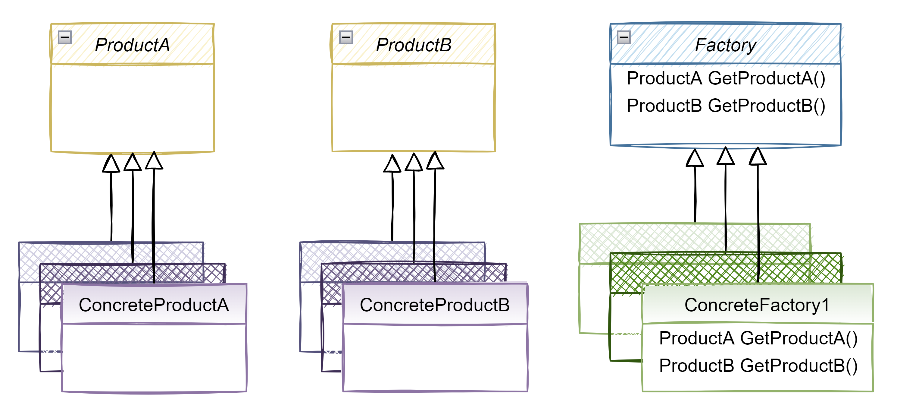
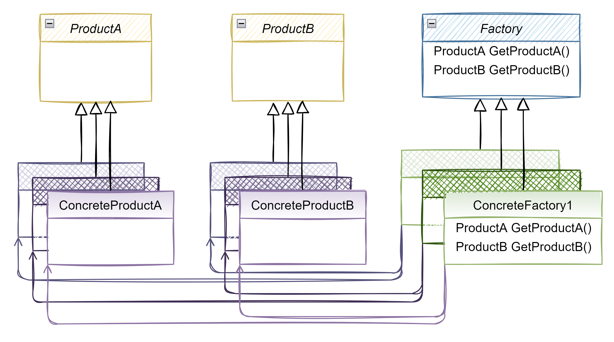

# Code using abstract factory design pattern

Now, using the abstract factory pattern, we can organize and structure the code so the responsibility of creating the objects are encapsulated in the Factories.

Take a look at the code 👀

If you run the project, the output will be the following:

```
MacOs Factory starting...
Creating an alert box that works on MacOs
> The MacOs alert box is now displayed
This is a button that works on MacOs
> The MacOs button is now displayed

Linux Factory starting...
This is an alert box that works on Linux
> The Linux alert box is now displayed
This is a button that works on Linux
> The Linux button is now displayed

Windows Factory starting...
This is an alert box that works on Windows
> The Windows alert box is now displayed
This is a button that works on Windows
> The Windows button is now displayed
```

## Example Use Case UML Diagram



And if we draw the `has a` arrows 👇



- `ConcreteFactory1` creates `ConcreteProductA` 1 and `ConcreteProductB` 1
- `ConcreteFactory2` creates `ConcreteProductA` 2 and `ConcreteProductB` 2
- `ConcreteFactory3` creates `ConcreteProductA` 3 and `ConcreteProductB` 3

# Try it yourself

You can run the console application to see the output in the console.

To do that, you can use your IDE buttons/options or via terminal, executing the following command:

> before executing the command, `cd` to this repository root directory

```bash
dotnet run --project ./AbstractFactoryPattern/AbstractFactoryPattern.WithPattern/AbstractFactoryPattern.WithPattern.csproj
```

[📄 Code without abstract factory pattern](../AbstractFactoryPattern.WithoutPattern/README.md)