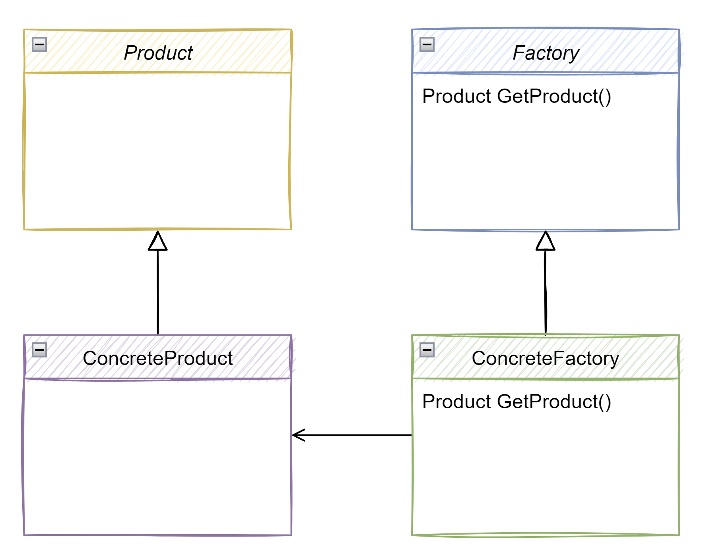
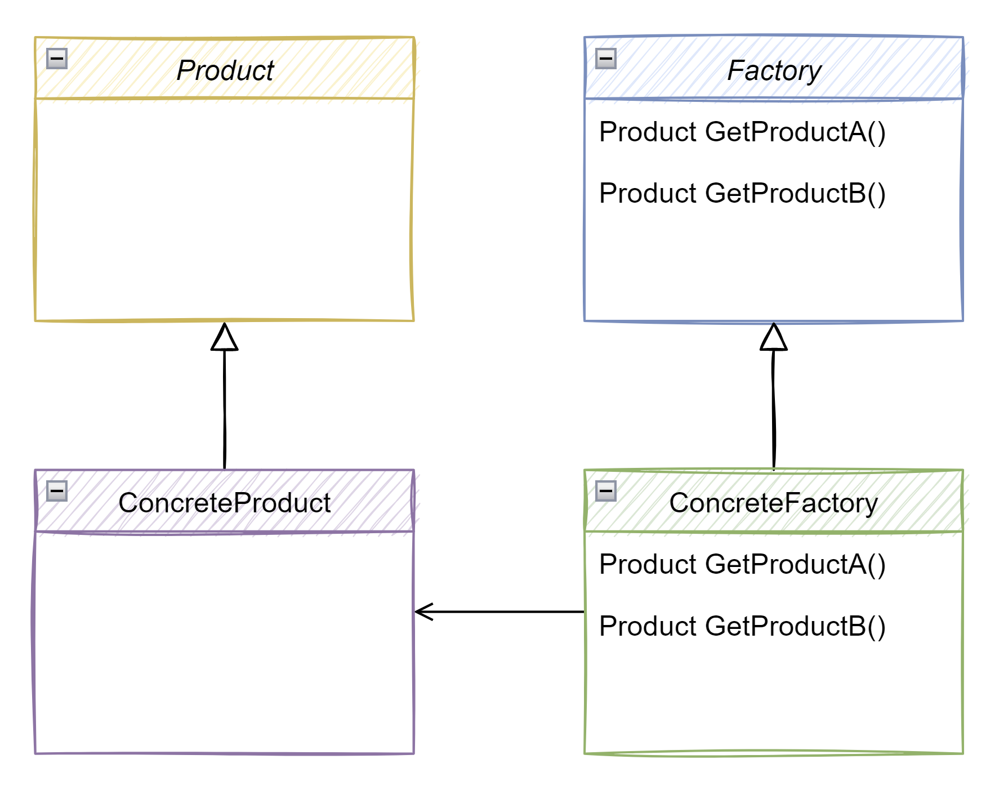

# Abstract Factory Design Pattern

If you already read the documentation about the factory method pattern, it will be very easy to understand the abstract factory pattern.

[📄 Read factory method documentation](../FactoryMethodPattern/README.md)

It will be very similar to the factory method pattern. Actually, in some sense, an abstract factory is a set of factory methods. So an abstract factory makes use of multiple factory methods.

## 📖 Official definition of the **Head First Design Patterns** book:

> The abstract factory pattern provides an interface for creating families of related or dependant objects without specifying their concrete classes.

So, if we contrast this with the factory method pattern, the single difference between this two is that the factory method pattern constructs a single object and the abstract factory method pattern constructs multiple objects.

Now, lets remember the UML diagram of the **factory method pattern** and then we will see how we go from the factory method pattern UML diagram to the abstract factory method pattern UML diagram 👇

## Factory Method UML Diagram

And now, this is the abstract factory UML diagram 👇

## Abstract Factory UML Diagram

The difference is that any factory does not only create a single product, but has the capability of producing multiple products.

So, whenever we have a concrete factory, that concrete factory cannot simply just have an implementation for `GetProduct`, it needs to have the implementation for `GetProductA` and it needs to have the implementation for `GetProductB`.

Lets get back to the definition of the **Head First Design Patterns** book:

> The abstract factory pattern provides an interface for creating families of related or dependant objects

Is referring to `GetProductA` and `GetProductB`, in other words, products of kind A and products of kind B.

> without specifying their concrete classes

Because the `Factory` has two methods, the `GetProductA` and `GetProductB` but it's not its responsibility to define which product to return, the responsible for that is the `ConcreteFactory`. So, the `GetProductA` returns a product and `GetProductB` also returns a product but only the `ConcreteFactory` will determine which products to return.

## 👍 Advantages

- You can be sure that the products you’re getting from a factory are compatible with each other.
- Avoid tight coupling between concrete products and client code.
- Single Responsibility Principle - You can extract the product creation code into one place, making the code easier to support.
- Open Closed Principle - Makes possible to interchange the concrete classes without changing the client code even at runtime.

## 👎 Disadvantages

- The code may become more complicated than it should be, since a lot of new interfaces and classes are introduced along with the pattern.

## Example Use Case of Abstract Factory Pattern

👉 **When you are building UI controls that need to be platform independent.**

Lets imagine that you creating an application that needs to run on MacOS, Linux and Windows. You can use 3 `ConcreteFactory` classes to create the application's UI controls for the 3 operating systems, for example:
- MacOsUiControlsFactory
- LinuxUiControlsFactory
- WindowsUiControlsFactory

The abstract factory is good to do this because you can use the `ConcreteFactory` to work with pairs. For example, we have the following UI controls:
- M
- N
- W
- X
- Y
- Z

And now, lets assume that the pairs that we can use to MacOS are X and Y, the pairs to Linux are W and X and the pairs to Windows are M and N. Lets also assume that the X, W and M are dialogs (alert boxes) and the Y, X and N are the button (f.e.: the Ok button).

The point here is that you can mix the UI controls but their mixes doesn't make sense because it's better to use them in the pair related to the operating system: X and Y together, W and X together and M and N together. It doesn't make sense to use the alert box (X) made for MacOS with the button (W) made for Linux.

If, to this example application you use **Factory Method Pattern**, you will be able to create the alert box and the button but you will loose the control of pairing those UI controls together grouped by operating system. But, if you use **Abstract Factory Pattern** you will have that control.

Now, lets take a look at the code examples, without the pattern and then using the pattern 👇

## Code and documentation

[📄 Code without design pattern](./AbstractFactoryPattern.WithoutPattern/README.md)

[📄 Code using design pattern](./AbstractFactoryPattern.WithPattern/README.md)