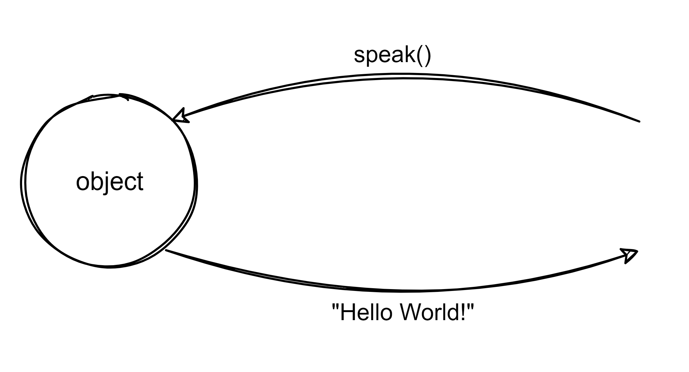
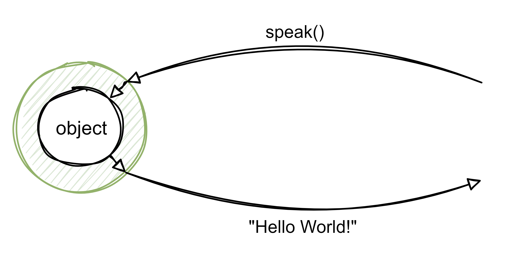
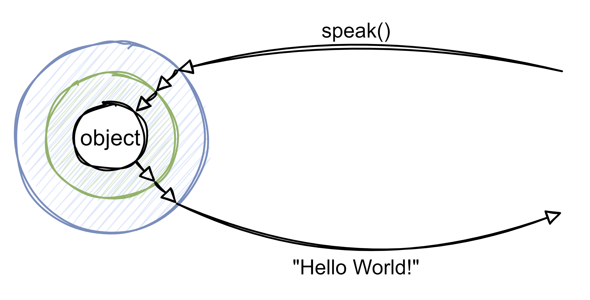

# Decorator Design Pattern

Decorator pattern is essentially about you having an object and, instead of simply sending messages to that object, you send a message to an outer object (wrapper) that then, that outer object, send the message to the inner object (the one that is being wrapped).

Lets see the diagram to understand better what this means:

Lets imagine that we have an object that has a method called `speak` and, when we invoke that method, the object returns the string `"Hello World!"`.

The decorator pattern is a way of saying: **_If I want to change the thing that is returning (in our case, the string), if I want to change the behavior of this method, I could actually do that in runtime without changing the contents of the object._**

Keep in mind that we are changing at runtime and not at compile time. And when we saying changing it at runtime, you can simply think of that as changing the behavior of the object without actually rewriting the contents of the object. Without actually opening up the class and changing the contents of that file.

So, with decorator pattern, what we do is, lets wrap the object in another object and when I invoke the method speak, I am actually invoking the method from the wrapper and not the object (the one that is being wrapped).

In other words, I will send a message to the outer object who will send a message to the inner object, who will send the message back to the outer object who will send a message back to me.

And we can keep on doing this indefinitely, this is the essence of the decorator pattern.

And we can have more wrappers...

We used the name wrapper before just to understand better but the actual name of the wrapper is decorator, so, essentially we are saying that the object is the component (it can be an object but it can be another thing) and its being wrapped by a decorator (and it can be wrapped by another decorator) and so on.

> When a decorator is being wrapped by another decorator, it is a decorator but also a component

The decorators behave like the component (the object) from the interface standpoint, in other words, they are exchangeable. So we are saying that you wrap the original component (object in our example) and then you can use the wrapper to pass them around as if it was one of the original component.

🤯🤯🤯

This last part may have been confusing but when we see the code, everything will become clearer.

## 📖 Official definition of the **Head First Design Patterns** book:

> The decorator pattern attaches additional responsibilities to an object, dynamically. Decorators provide a flexible alternative to sub-classing for extending functionality.

### Lets brake this down

> The decorator pattern attaches additional responsibilities to an object

This means that the object (component) was initially doing something but now, using decorator pattern, we attached additional responsibilities. The first wrapper attaches some additional responsibilities and the second wrapper attaches more responsibilities.

> dynamically

Because we can change it at runtime or at compile time. We can attach additional responsibilities at runtime.

> Decorators provide a flexible alternative to sub-classing for extending functionality

To understand this, lets stand with this sentences:
- _Inheritance is not for code reuse_
- _Inheritance is not for sharing behaviors_

It is a way of using composition rather than inheritance in order to share behaviors. With decorator pattern we use `is a` (inheritance) but only yo make the wrapper (decorator) behave as if it was the object (component).

So, we are not using inheritance to share behaviors, we are using composition to share behaviors, we just use inheritance to make the outer objects behave like like the object.

You can also think in this, this way: If you define subclass A, subclass B and subclass C then you only have A, B and C and you can somehow **compose** a new class at runtime that is the **composition** of A and B or B and C or A and C. With decorators, that actually what we are doing, we are defining the decorator A, the decorator B and the decorator C and then we can compose both decorator A and B at the same time so it's more flexible. 

## 👍 Advantages

- High degree of flexibility
- Expansion of function of classes without inheritance
- Resource-optimized functionalities
- Readable code

## 👎 Disadvantages

- High complexity of software (especially decorator interface) 
- Not beginner-friendly
- High number of objects
- Difficult debugging process

## Code and documentation

[📄 Code without design pattern](./DecoratorPattern.WithoutPattern/README.md)

[📄 Code using design pattern](./DecoratorPattern.WithPattern/README.md)