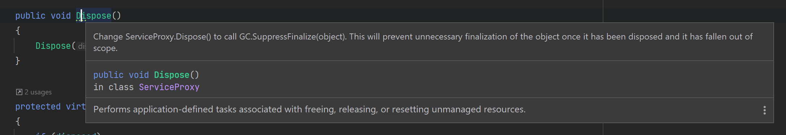

# Dispose Design Pattern

Implementing the Dispose method is primarily for releasing unmanaged resources. When working with instance members that are IDisposable implementations, it's common to cascade Dispose calls. There are additional reasons for implementing Dispose, for example, to free memory that was allocated, remove an item that was added to a collection, or signal the release of a lock that was acquired.

The .NET garbage collector does not allocate or release unmanaged memory. The pattern for disposing an object, referred to as the dispose pattern, imposes order on the lifetime of an object. The dispose pattern is used for objects that implement the IDisposable interface, and is common when interacting with file and pipe handles, registry handles, wait handles, or pointers to blocks of unmanaged memory. This is because the garbage collector is unable to reclaim unmanaged objects.

To help ensure that resources are always cleaned up appropriately, a Dispose method should be idempotent, such that it is callable multiple times without throwing an exception. Furthermore, subsequent invocations of Dispose should do nothing.

## Advantages

- ...

## Disadvantages

- ...

## Why use `IHttpClientFactory`?

When you dispose of a HttpClient instance, the connection remains open for up to four minutes. Further, the number of sockets that you can open at any point in time has a limit — you can’t have too many sockets open at once. So when you use too many HttpClient instances, you might end up exhausting your supply of sockets.

Here’s where IHttpClientFactory comes to the rescue. You can take advantage of IHttpClientFactory to create HttpClient instances for invoking HTTP API methods by adhering to the best practices to avoid issues faced with HttpClient. The primary goal of IHttpClientFactory in ASP.NET Core is to ensure that HttpClient instances are created using the factory while at the same time eliminating socket exhaustion.

## Implement the dispose pattern for a derived class

A class derived from a class that implements the IDisposable interface shouldn't implement IDisposable, because the base class implementation of IDisposable.Dispose is inherited by its derived classes. Instead, to clean up a derived class, you provide the following:

- A protected override void Dispose(bool) method that overrides the base class method and performs the actual cleanup of the derived class. This method must also call the base.Dispose(bool) (MyBase.Dispose(bool) in Visual Basic) method passing it the disposing status (bool disposing parameter) as an argument.

- Either a class derived from SafeHandle that wraps your unmanaged resource (recommended), or an override to the Object.Finalize method. The SafeHandle class provides a finalizer that frees you from having to code one. If you do provide a finalizer, it must call the Dispose(bool) overload with false argument.

Here's an example of the general pattern for implementing the dispose pattern for a derived class that uses a safe handle:

```csharp
using Microsoft.Win32.SafeHandles;
using System;
using System.Runtime.InteropServices;

class DerivedClassWithSafeHandle : BaseClassWithSafeHandle
{
    // To detect redundant calls
    private bool _disposedValue;

    // Instantiate a SafeHandle instance.
    private SafeHandle _safeHandle = new SafeFileHandle(IntPtr.Zero, true);

    // Protected implementation of Dispose pattern.
    protected override void Dispose(bool disposing)
    {
        if (!_disposedValue)
        {
            if (disposing)
            {
                _safeHandle.Dispose();
            }

            _disposedValue = true;
        }

        // Call base class implementation.
        base.Dispose(disposing);
    }
}
```

## 📝 And what about the `using` keyword?

We can find the following code in the `DisposePattern.WithPattern` project:

```csharp
using var serviceProxy = new ServiceProxy(null);
```

The `using` keyword is basically a `try` + `finally` block, so the code above, behind the hood is reduced to the following:

```csharp
ServiceProxy serviceProxy = null;

try
{
    serviceProxy = new ServiceProxy(null);

    serviceProxy.Get();
    serviceProxy.Post("");
}
finally
{
    serviceProxy.Dispose();
}
```

In order for you to use the `using` keyword, you must implement the `IDisposable` interface, otherwise, you will see an error in the `Program.cs`:


Also, the using without braces were introduced in C#8 so, if you try it on C#7 for example, it will not work and you need to add braces, to be like this:

```csharp
    using (var serviceProxy = new ServiceProxy(null))
    {
        serviceProxy.Get();
        serviceProxy.Post("");
    }
```

[📄 Microsoft documentation about `using` keyword](https://docs.microsoft.com/en-us/dotnet/csharp/language-reference/keywords/using)

### And if I forgot to use the `using` keyword?

If the caller of the class forget to use the `using` keyword, you will have a memory leak and to prevent that, you need to do the following:

✅ Add a destructor, like this:

```csharp
~ServiceProxy()
{
    Dispose(false);
}
```

And then you will see a warning in the IDE saying:



✅ To solve it, you need to change the `Dispose` method to be like this:

```csharp
public void Dispose()
{
    Dispose(true);
    GC.SuppressFinalize(this);
}
```

Now, the caller can use the `using` keyword or not because your class is prepared to destruct itself after being used.