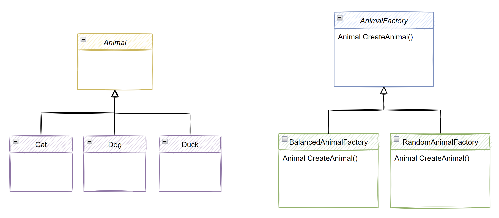

# Factory Method Design Pattern

📝 Also known as **Virtual Constructor**

Lets imagine that we are working on a system that has a bunch of classes. We have A, B and C. And lets assume that this 3 classes inherit from a superclass or implements some interface.

Now lets say that in a particular moment, in our application, we want to instantiate one of this things, for some reason. In a moment, we need to use either A or B or C. And the point is, upon invoking the method in which we want to instantiate, we cannot know which one to instantiate. **Because, if we knew which one to instantiate, then we are not talking about a factory method**. To do that, knowing which one to instantiate, we could simply use dependency injection.

Also, lets imagine that, when we instantiate the object, we need some kind of logic. We can imagine a game where we are using a starship to destroy asteroids and the factory method will instantiate the objects bases on some business logic, for example, the level that we are, the difficulty that we chose, the type of asteroids, etc.

So, the factory method is responsible for encapsulating and for keeping all the business logic of creation of something of a shared type.

Now, there are two things that we need to understand:
1. The things that we are creating
1. The way in which we can create this things

To understand this better, lets look at some class diagrams 👇

Back to the 2 things, the left class diagram, Animal, Cat, Dog and Duck are the first thing, the things that we are creating and the right class diagram is the second thing, the way in which we can create this things.

For example, the `RandomAnimalFactory` is a factory method that always creates a random animal. It does not have state, every time we invoke it, a random `Animal` is returned and the `BalancedAnimalFactory` has state, it starts to create a new `Animal` but then, only randomizes the other animals different that the ones that were already created.

> This is just an example to show how we can use the factory method

The generic class diagram of the factory method is the following 👇

## 📖 Official definition of the **Head First Design Patterns** book:

> The factory method pattern defines an interface for creating an object, but lets subclasses decide which class to instantiate. Factory method lets the class defer instantiation to subclasses.

### Lets break this down

> The factory method pattern defines an interface

Here we are not talking about a literal interface (f.e.: IAnimal) but interface in therms of contract. It defines a common contract with under which you can refer to this particular thing. In other words, it can be an interface (f.e.: IAnimal) but it can also be a superclass.

> for creating an object

So the key point of factory method plan is that in the end, you want an object. You don't necessarily know how you want to construct that object, why you want to construct that object and what parameters you want to pass when constructing that object. These are all unknowns and that's why you want to defer, this is why you want to let somebody else take that decision.

> but lets subclasses decide which class to instantiate

And it not only about which class can instantiate, it's also about what you actually want to pass to that class that you are instantiating.

> Factory method lets the class defer instantiation to subclasses

This means that the common ancestors (`Product` in the generic diagram above) defer instantiation to the subclasses (`ConcreteProduct` in the generic diagram). For example, now taking the example class diagram, that the `Animal` does not have to make the decision about which of the animal classes (`Cat`, `Dog` or `Duck`) to instantiate. The ones that needs to decide are the `RandomAnimalFactory` and the `BalancedAnimalFactory`.

## 👍 Advantages

- Avoid tight coupling between the creator and the concrete products.
- Single Responsibility Principle: you can move the product creation code into one place in the program, making the code easier to support.
- Open/Closed Principle: you can introduce new types of products into the program without breaking existing client code.

## 👎 Disadvantages

- The code may become more complicated since you need to introduce a lot of new subclasses to implement the pattern. The best case scenario is when you’re introducing the pattern into an existing hierarchy of creator classes.

## Code and documentation

[📄 Code without design pattern](./FactoryMethodPattern.WithoutPattern/README.md)

[📄 Code using design pattern](./FactoryMethodPattern.WithPattern/README.md)