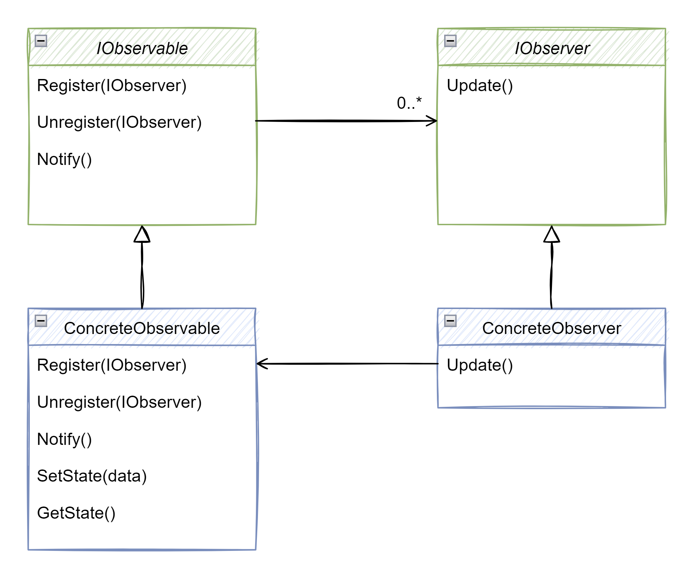
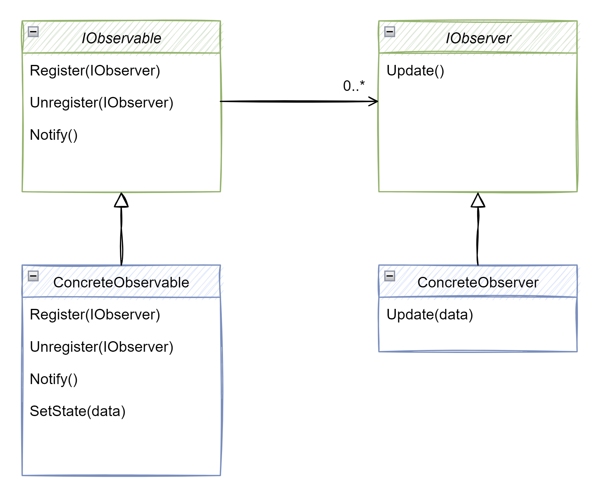

# Code using observer design pattern

Lets assume that we have a weather station that is the observable/subject and this weather station is responsible for notifying its registered observers/subscribers whenever the temperature changes.

There will be two observers/subscribers, one news agency and one weather app (mobile app for example). These two observers will be notified and display the updated data, both in the console but in a real scenario, in a television, radio, screen, etc.

Also, we are assuming the following for our code example:
- The data is the temperature in degrees Celsius (float property):
- The weather station will not save the temperature in this example
- This notification will happen every time the temperature (float property) changes, in other words, whenever a new temperature is measured, all the observers will be notified
- The communication mechanism used will be a push mechanism _(read the next section to understand this better)_, in other words, the observers, when notified, will also receive the temperature in via parameter sent from the weather station
- Both the news agency and the weather app will display the temperature when the observable/subject invoke their `Update` method, to keep it simple

> This is just an example of the implementation of the observer pattern. Each system has its own specifications and requirements and you can create more systems using observer pattern but with different architecture and structure.

# Communication Mechanism

There are two communication mechanisms, pull or push

## Pull 📤

In pull mechanism as well, it is the Observable's responsibility to notify all observer that something has been changed, but this time Observable shares the whole object which has the changes, some observers might not require the complete object, so Observers just need extract the required details from that complete project in their update methods.

### 👍 Advantages

More flexibility: Each observer can decide for itself what to query, without relying on the subject to send the correct (only required) information

### 👎 Disadvantages

The observers would have to know things about the subject in order to query the right information from the shared complete object

### 👤 Use-Case

It should be used when there are more than 2-3 different types of Observers (different types means observer require different data).

Like publishing of FX Rates by any foreign exchange rates provider for different investment banks. In this Some banks just deals with only INR, some others only GBP etc. so it should be implemented using Pull mechanism as compared to Push mechanism.

## Push 📥

This is purely the Observable's responsibility, Observer just need to make sure they have put required code in their update methods.

### 👍 Advantages

Lower coupling between the observer and the subject: Observable & Observer both are interfaces/abstract classes which is actually a design principle - Program to interface or supertype

### 👎 Disadvantages

Less flexibility : As Observable needs to send the required data to the Observer and it would become messy if we have say 1000 observers and most of them require different types of data.

### 👤 Use-Case

It should be used when there are max 2-3 different types of Observers (different types means observer require different data) or all observers require same type of data.

Like token systems in a bank: In this all observers (different LEDs) just need one notification the list of updated waiting token numbers, so may better be implemented in this way as compared to Pull Mechanism.

## Overview of the Code

<details>
    <summary><b>Using Pull Mechanism</b></summary>

When using the pull mechanism, the Concrete Observer must have a reference to the Concrete Observable because the observer needs to select data from the observable and to do that, it needs to access its `GetState` method.



`IObservable.cs`

```csharp
/// <summary>
/// Can be called ISubject
/// </summary>
public interface IObservable
{
    /// <summary>
    /// Register (add) an observer/subscriber
    /// </summary>
    /// <param name="observer"></param>
    void Register(IObserver observer);
    
    /// <summary>
    /// Unregister (remove) an observer/subscriber
    /// </summary>
    /// <param name="observer"></param>
    void Unregister(IObserver observer);
    
    /// <summary>
    /// Notify (broadcast) all the registered observers/subscribers
    /// </summary>
    void Notify();
}
```

`ConcreteObservable.cs`

```csharp
/// <summary>
/// Concrete observable
/// </summary>
public class ConcreteObservable : IObservable
{
    /// <summary>
    /// The list of observers/subscribers registered
    /// </summary>
    private readonly IList<IObserver> _observers;

    private object _data;

    public ConcreteObservable()
    {
        _observers = new List<IObserver>();
    }
    
    public void Register(IObserver observer)
    {
        _observers.Add(observer);
    }

    public void Unregister(IObserver observer)
    {
        _observers.Remove(observer);
    }

    public void Notify()
    {
        foreach (var observer in _observers)
        {
            observer.Update();
        }
    }

    public void SetData(object data)
    {
        _data = data;
        Notify();
    }

    public object GetData()
    {
        return _data;
    }
}
```

`IObserver.cs`

```csharp
/// <summary>
/// Can be called ISubscriber
/// </summary>
public interface IObserver
{
    /// <summary>
    /// Update the data using pull mechanism
    /// </summary>
    void Update();
}
```

`ConcreteObserver.cs`

```csharp
/// <summary>
/// Concrete observer
/// </summary>
public class ConcreteObserver : IObserver
{
    private readonly ConcreteObservable _observable;
    private readonly IDisplay _displayImplementation;

    public ConcreteObserver(ConcreteObservable observable, IDisplay displayImplementation)
    {
        _observable = observable;
        _displayImplementation = displayImplementation;
    }
    
    public void Update()
    {
        var data = _observable.GetData();
        
        Console.WriteLine($"Updated data: {data}");
    }
}
```

`Program.cs`

```csharp
using ObserverPattern.WithPattern;
using ObserverPattern.WithPattern.Implementations;

var weatherStation = new WeatherStation();
var displayTemperature = new DisplayTemperature();

var channel1 = new NewsAgency("Channel 1", weatherStation, displayTemperature);
weatherStation.Register(channel1);

var channel2 = new NewsAgency("Channel 2", weatherStation, displayTemperature);
weatherStation.Register(channel2);

var weatherApp = new WeatherApp(weatherStation, displayTemperature);
weatherStation.Register(weatherApp);

weatherStation.SetTemperature(22.3f);

// we can register and unregister a observer/subscriber whenever we want
// lets unregister channel2 for example
weatherStation.Unregister(channel2);
// now, the next temperature measurements will be displayed only in channel1 and weather app

weatherStation.SetTemperature(16);

weatherStation.SetTemperature(39.8f);
```

</details>

<details>
    <summary><b>Using Push Mechanism</b></summary>

Using the push mechanism, the concrete observer no longer needs to reference the concrete observable because the data is pushed from the observable to the observer in the method `Notify`.



`IObservable.cs`

```csharp
/// <summary>
/// Can be called ISubject
/// </summary>
public interface IObservable
{
    /// <summary>
    /// Register (add) an observer/subscriber
    /// </summary>
    /// <param name="observer"></param>
    void Register(IObserver observer);
    
    /// <summary>
    /// Unregister (remove) an observer/subscriber
    /// </summary>
    /// <param name="observer"></param>
    void Unregister(IObserver observer);
    
    /// <summary>
    /// Notify (broadcast) all the registered observers/subscribers
    /// </summary>
    void Notify(object data);
}
```

`ConcreteObservable.cs`

```csharp
/// <summary>
/// Concrete observable
/// </summary>
public class ConcreteObservable : IObservable
{
    /// <summary>
    /// The list of observers/subscribers registered
    /// </summary>
    private readonly IList<IObserver> _observers;

    private object _data;

    public ConcreteObservable()
    {
        _observers = new List<IObserver>();
    }
    
    public void Register(IObserver observer)
    {
        _observers.Add(observer);
    }

    public void Unregister(IObserver observer)
    {
        _observers.Remove(observer);
    }

    public void Notify(object data)
    {
        foreach (var observer in _observers)
        {
            observer.Update(data);
        }
    }

    public void SetData(object data)
    {
        _data = data;
        Notify(data);
    }
}
```

`IObserver.cs`

```csharp
/// <summary>
/// Can be called ISubscriber
/// </summary>
public interface IObserver
{
    /// <summary>
    /// Update the data using push mechanism
    /// </summary>
    void Update(object data);
}
```

`ConcreteObserver.cs`

```csharp
/// <summary>
/// Concrete observer
/// </summary>
public class ConcreteObserver : IObserver
{
    private readonly IDisplay _displayImplementation;

    public ConcreteObserver(IDisplay displayImplementation)
    {
        _displayImplementation = displayImplementation;
    }
    
    public void Update(object data)
    {
        Console.WriteLine($"Updated data: {data}");
    }
}
```

`Program.cs`

```csharp
using ObserverPattern.WithPattern;
using ObserverPattern.WithPattern.Implementations;

var weatherStation = new WeatherStation();
var displayTemperature = new DisplayTemperature();

var channel1 = new NewsAgency("Channel 1", displayTemperature);
weatherStation.Register(channel1);

var channel2 = new NewsAgency("Channel 2", displayTemperature);
weatherStation.Register(channel2);

var weatherApp = new WeatherApp(displayTemperature);
weatherStation.Register(weatherApp);

weatherStation.SetTemperature(22.3f);

// we can register and unregister a observer/subscriber whenever we want
// lets unregister channel2 for example
weatherStation.Unregister(channel2);
// now, the next temperature measurements will be displayed only in channel1 and weather app

weatherStation.SetTemperature(16);

weatherStation.SetTemperature(39.8f);
```

</details>

<br>

### Example of an Output

```
[Channel 1] The temperature is 22.3ºC
[Channel 2] The temperature is 22.3ºC
[Weather App] The temperature is 22.3ºC

[Channel 1] The temperature is 16ºC
[Weather App] The temperature is 16ºC

[Channel 1] The temperature is 39.8ºC
[Weather App] The temperature is 39.8ºC
```

# Try it yourself

You can run the console application to see the output in the console.

To do that, you can use your IDE buttons/options or via terminal, executing the following command:

> before executing the command, `cd` to this repository root directory

```bash
dotnet run --project ./ObserverPattern/ObserverPattern.WithPattern/ObserverPattern.WithPattern.csproj
```

[📄 Code without observer pattern](../ObserverPattern.WithoutPattern/README.md)