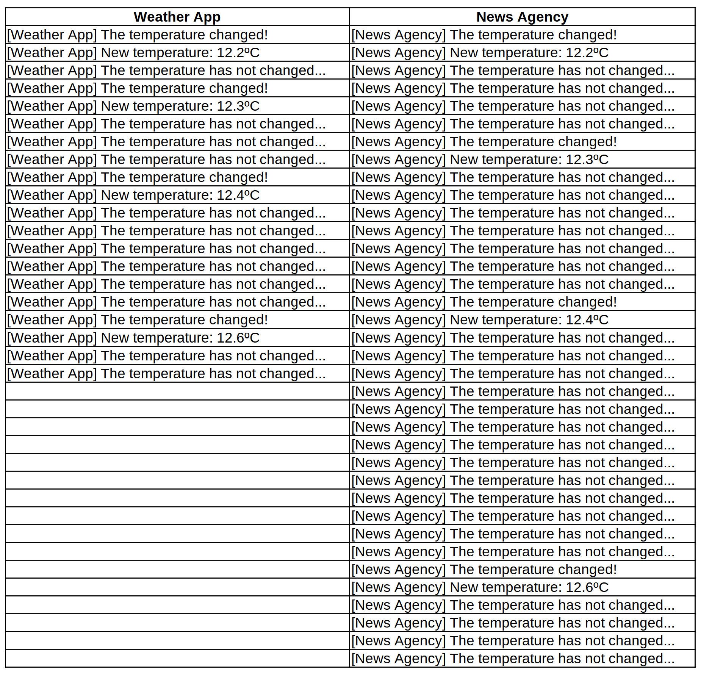

# Code without observer design pattern

In the code example we got implemented a Polling mechanism system.

> This is just an example, you can create another polling mechanism with different architecture or requirements

Here we got two classes, the `WeatherStation.cs` and the `WeatherApp.cs`. The weather station do not save the temperature, to keep it simple and do not notify the weather app that the state (temperature) changed because we are using a polling mechanism which means that the weather app needs to keep selecting the state (temperature) from the weather station and, if it is different from the previously selected, show it in the interface (here we will show in the console to keep it simple).

`WeatherStation.cs`

```csharp	
public class WeatherStation
{
    /// <summary>
    /// The temperature in degrees Celsius
    /// </summary>
    private float Celsius { get; set; }

    public void SetTemperature(float celsius)
    {
        Celsius = celsius;
    }

    public float GetTemperature()
    {
        return Celsius;
    }
}
```

`WeatherApp.cs`

```csharp	
public class WeatherApp
{
    private readonly WeatherStation _weatherStation;
    
    /// <summary>
    /// The timer that will be responsible to do the polling mechanism
    /// </summary>
    private readonly Timer _timer;
    
    /// <summary>
    /// The temperature in degrees Celsius
    /// </summary>
    private float Celsius { get; set; }

    public WeatherApp(WeatherStation weatherStation)
    {
        _weatherStation = weatherStation;

        _timer = new Timer(1000)
        {
            AutoReset = true
        };

        _timer.Elapsed += TimerElapsed;
    }

    /// <summary>
    /// Event that will be triggered by the timer,
    /// will grab the data from the Weather Station
    /// and display it in the console
    /// </summary>
    /// <param name="sender"></param>
    /// <param name="e"></param>
    private void TimerElapsed(object? sender, ElapsedEventArgs e)
    {
        var celsius = _weatherStation.GetTemperature();

        if (celsius != Celsius)
        {
            Celsius = celsius;
                
            Console.WriteLine($"The temperature changed!");
            Console.WriteLine($"New temperature: {Celsius}ºC");
        }
        else
        {
            Console.WriteLine($"The temperature has not changed...");
        }
    }

    public void StartTimer()
    {
        _timer.Start();
    }

    public void StopTimer()
    {
        _timer.Stop();
    }
}
```

As we can see from the code, the weather app invokes the weather station's method `GetTemperature` and verifies if the temperature changed compared to the previously selected. If so, show it, else, show a generic message saying that the temperature has not changed.

To make this code work, we need to have something starting the timer and creating the objects instances, to do it we got the class `Program.cs` 👇

`Program.cs`

```csharp
var weatherStation = new WeatherStation();
weatherStation.SetTemperature(12.2f);

var weatherApp = new WeatherApp(weatherStation);
weatherApp.StartTimer();

weatherStation.SetTemperature(12.3f);
weatherStation.SetTemperature(12.4f);
weatherStation.SetTemperature(12.6f);

weatherApp.StopTimer();
```

> If you open the code you will see a few more lines creating a `Thread.Sleep` to simulate a real world scenario but for the documentation we will keep it simple because we will focus on understanding the system.

With just one application doing polling mechanism, the log is the following:

```
[Weather App] The temperature changed!
[Weather App] New temperature: 12.2ºC
[Weather App] The temperature has not changed...
[Weather App] The temperature changed!
[Weather App] New temperature: 12.3ºC
[Weather App] The temperature has not changed...
[Weather App] The temperature has not changed...
[Weather App] The temperature has not changed...
[Weather App] The temperature changed!
[Weather App] New temperature: 12.4ºC
[Weather App] The temperature has not changed...
[Weather App] The temperature has not changed...
[Weather App] The temperature has not changed...
[Weather App] The temperature has not changed...
[Weather App] The temperature has not changed...
[Weather App] The temperature has not changed...
[Weather App] The temperature changed!
[Weather App] New temperature: 12.6ºC
[Weather App] The temperature has not changed...
[Weather App] The temperature has not changed...
```

If we add another application, for example, a News Agency, the polling mechanism will scale and we saw [here](https://github.com/pncsoares/dotnet-design-patterns/blob/main/ObserverPattern/README.md#poll) in the documentation.

So lets add the news agency...it will be a mess 🤯

`NewsAgency.cs`

```csharp
public class NewsAgency
{
    private readonly WeatherStation _weatherStation;
    
    /// <summary>
    /// The timer that will be responsible to do the polling mechanism
    /// </summary>
    private readonly Timer _timer;

    private const string Name = "News Agency";
    
    /// <summary>
    /// The temperature in degrees Celsius
    /// </summary>
    private float Celsius { get; set; }

    public NewsAgency(WeatherStation weatherStation)
    {
        _weatherStation = weatherStation;

        _timer = new Timer(500)
        {
            AutoReset = true
        };

        _timer.Elapsed += TimerElapsed;
    }

    /// <summary>
    /// Event that will be triggered by the timer,
    /// will grab the data from the Weather Station
    /// and display it in the console
    /// </summary>
    /// <param name="sender"></param>
    /// <param name="e"></param>
    private void TimerElapsed(object? sender, ElapsedEventArgs e)
    {
        var celsius = _weatherStation.GetTemperature();

        if (celsius != Celsius)
        {
            Celsius = celsius;
                
            Console.WriteLine($"[{Name}] The temperature changed!");
            Console.WriteLine($"[{Name}] New temperature: {Celsius}ºC");
        }
        else
        {
            Console.WriteLine($"[{Name}] The temperature has not changed...");
        }
    }

    public void StartTimer()
    {
        _timer.Start();
    }

    public void StopTimer()
    {
        _timer.Stop();
    }
}
```

Here, the polling have an interval of 500 ms or half a second.

`Program.cs`

```csharp
using ObserverPattern.WithoutPattern;

var weatherStation = new WeatherStation();

weatherStation.SetTemperature(12.2f);

var weatherApp = new WeatherApp(weatherStation);
weatherApp.StartTimer();

var newsAgency = new NewsAgency(weatherStation);
newsAgency.StartTimer();

weatherStation.SetTemperature(12.3f);
weatherStation.SetTemperature(12.4f);
weatherStation.SetTemperature(12.6f);

weatherApp.StopTimer();
newsAgency.StopTimer();
```

Now, we started a timer to the weather app and to the news agency. We had to stop the time to both too.

Here is the log generated by this two applications:

```
[News Agency] The temperature changed!
[News Agency] New temperature: 12.2ºC
[News Agency] The temperature has not changed...
[Weather App] The temperature changed!
[Weather App] New temperature: 12.2ºC
[News Agency] The temperature has not changed...
[News Agency] The temperature has not changed...
[Weather App] The temperature has not changed...
[News Agency] The temperature has not changed...
[Weather App] The temperature changed!
[News Agency] The temperature changed!
[News Agency] New temperature: 12.3ºC
[Weather App] New temperature: 12.3ºC
[News Agency] The temperature has not changed...
[Weather App] The temperature has not changed...
[News Agency] The temperature has not changed...
[News Agency] The temperature has not changed...
[Weather App] The temperature has not changed...
[News Agency] The temperature has not changed...
[News Agency] The temperature has not changed...
[Weather App] The temperature has not changed...
[News Agency] The temperature has not changed...
[News Agency] The temperature has not changed...
[Weather App] The temperature changed!
[Weather App] New temperature: 12.4ºC
[News Agency] The temperature changed!
[News Agency] New temperature: 12.4ºC
[News Agency] The temperature has not changed...
[Weather App] The temperature has not changed...
[News Agency] The temperature has not changed...
[News Agency] The temperature has not changed...
[Weather App] The temperature has not changed...
[News Agency] The temperature has not changed...
[News Agency] The temperature has not changed...
[News Agency] The temperature has not changed...
[Weather App] The temperature has not changed...
[News Agency] The temperature has not changed...
[Weather App] The temperature has not changed...
[News Agency] The temperature has not changed...
[News Agency] The temperature has not changed...
[Weather App] The temperature has not changed...
[News Agency] The temperature has not changed...
[News Agency] The temperature has not changed...
[News Agency] The temperature has not changed...
[Weather App] The temperature has not changed...
[News Agency] The temperature has not changed...
[News Agency] The temperature changed!
[News Agency] New temperature: 12.6ºC
[Weather App] The temperature changed!
[Weather App] New temperature: 12.6ºC
[News Agency] The temperature has not changed...
[News Agency] The temperature has not changed...
[Weather App] The temperature has not changed...
[News Agency] The temperature has not changed...
[Weather App] The temperature has not changed...
[News Agency] The temperature has not changed...
```

We can split it to analyze it better:



As we can see, this is not the best approach when we have to display/communicate/alert something in one system when something changes in another system.

# Try it yourself

You can run the console application to see the output in the console. **The console app will take about 15 seconds to run because we are using `Thread.Sleep` in order to simulate a real life scenario**.

To do that, you can use your IDE buttons/options or via terminal, executing the following command:

> before executing the command, `cd` to this repository root directory

```bash
dotnet run --project ./ObserverPattern/ObserverPattern.WithoutPattern/ObserverPattern.WithoutPattern.csproj
```

Now lets see the code using the observer pattern 👇

[📄 Code using observer pattern](../ObserverPattern.WithPattern/README.md)