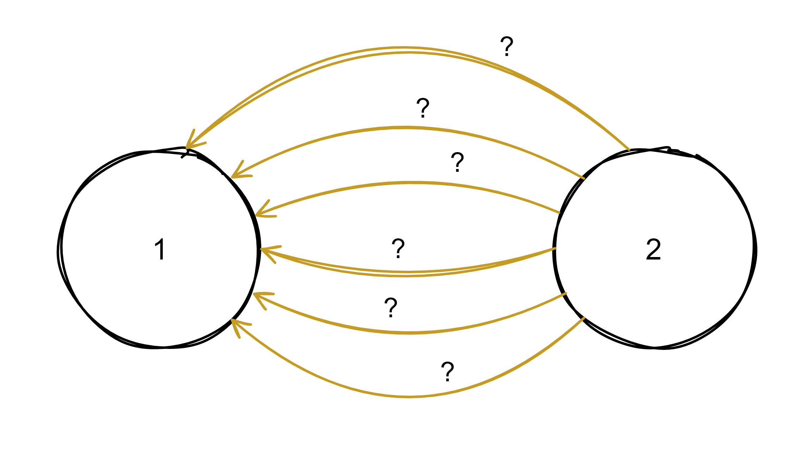
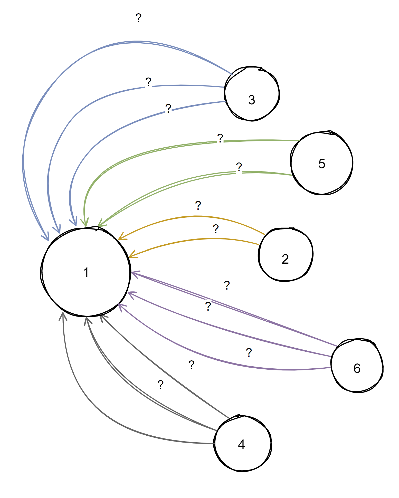
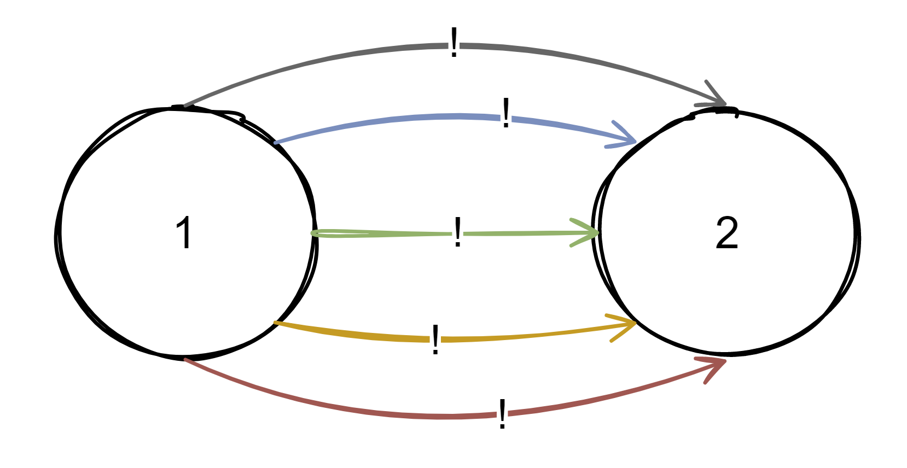
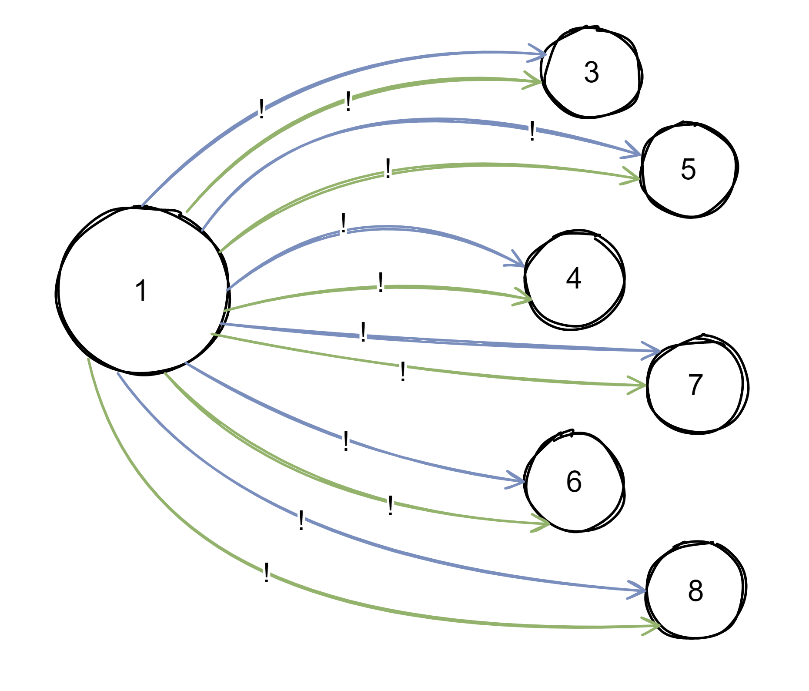

# Observer Design Pattern

The observer pattern is essentially about **push** vs **poll**. Its about moving from poll architecture to push architecture.

**But, what is push and what is poll?** 🤔

To understand this better, lets imagine that we have two things:

## Thing 1️

The first thing changes state, first we have state one, then we will have state two, then 3 and so on. Over time it changes its internal state.

It can do another things like take measurements, calculations and others but all we care about for now is that it changes state.

## Thing 2️

And then we have the second thing and this thing wants to know, for some reason, about the state of the first thing. We call the second thing, a subscriber and the first thing, a publisher

> 📝 **NOTE**
>
> This second thing will not implement or inherit the objects of the first thing, it just needs to know whenever the first thing changes state. 

Now lets see what is push and what is poll 👇

## Poll

Polling is the subscriber asking the publisher: _"Have you changed?"_ over and over again.

It just keeps asking and asking indefinitely because the thing 2 do not know when the state of the thing 1 change. To build this you need to ask yourself, am I doing this every second? What if it changes every half a second?

If you scale this up, this became an absurd...

Imagine this every half a second 💣

So, poll is the act of asking for the data before we know that the data has changed.

## Push

In push, the publisher has the responsibility to tell all the subscribers that the state has changed. There is no polling nor communication interval, just a push every time the state changes.

In practice, the thing 1 has a change, it pushes, it has a change, it pushes and do this to all the subscribers.

And if we scale this up, it's more controlled.

In the essence, this is the observer pattern! Then is just the syntactics and how to build that.

But, now we are assuming that the thing 1 has some knowledge about who the subscribers are and also all the `subscribers` (thing 2) need to register to the `subject` (thing 1). The subscribers are `observers` and the subject is the `observable`.

> 📝 **NOTE**
>
> In books and articles or documentation, the observable is sometimes referred as the subject and the observers are are sometimes referred as the subscribers, so keep that in mind
>
> `observable == subject`
> 
> `observers == subscribers`

And this is the observer pattern in a nutshell 👆

## 📖 Official definition of the **Head First Design Patterns** book:

> The observer pattern defines a one to many dependency between objects so that when one object changes state, all of its dependencies are notified and updated automatically.

## 👍 Advantages

- Open/Closed Principle. You can introduce new subscriber classes without having to change the publisher’s code (and vice versa if there’s a publisher interface)
- It allows sending data to other objects effectively without any change in the Subject or Observer classes
- Observers can be added/removed at any point in time
- You can establish relations between objects at runtime

## 👎 Disadvantages

- The Observer interface has to be implemented by ConcreteObserver, which involves inheritance. There is no option for composition, as the Observer interface can be instantiated
- If not correctly implemented, the Observer can add complexity and lead to inadvertent performance issues
- Subscribers are notified in random order

## Code and documentation

We will use a weather station as the observable and a news agency as the observer to exemplify and explain this design pattern.

[📄 Code without design pattern](./ObserverPattern.WithoutPattern/README.md)

[📄 Code using design pattern](./ObserverPattern.WithPattern/README.md)