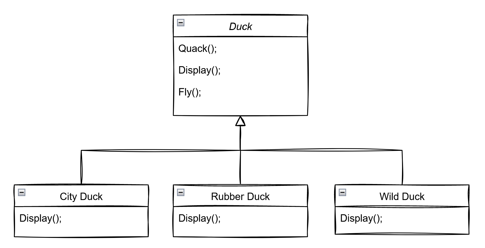

# Strategy Design Pattern

This is simplest design patterns to understand.

If I would define this pattern in a few words, I would say that it is about using composition rather than inheritance because this pattern defends that inheritance is not intended for code reuse.

Official definition of the **Head First Design Patterns** book:

> The strategy design pattern defines a family of algorithms, encapsulates each one and makes them interchangeable. Strategy lets the algorithm very independently from clients that use it.

## Advantages

- Prevents the conditional statements (`switch`, `if`, `else`, ...)
- The algorithms are loosely coupled with the context entity. They can be changed/replaced without changing the context entity
- Very easy extendable

## Disadvantages

- Clients must know existence of different strategies
- Client must understand how the strategies differ
- It increases the number of objects in the application

# Example use case

> Within this documentation, behavior and strategy has absolutely the same meaning

There is a duck superclass and two subclasses, city duck and wild duck.

So, the superclass Duck has two methods, `Quack` and `Display`. The subclasses are responsible for implementing their own version of `Display` method. The behavior of `Quack` is shared between the two types of ducks, the city duck and the wild duck.

> 📝 **NOTE**
> 
> Take into consideration that, in [UML](https://en.wikipedia.org/wiki/Unified_Modeling_Language), we use two arrows to describe inheritance and composition
> 
> **Inheritance**
> 
> 
> 
> **Composition**
> 
> 

So far, all seems fine and in fact it is. The problems start to happen when we as developers need to change the the source code, when the requirements change.

Lets say that we now need another method, the `Fly` method. The city duck and the wild duck now have the ability to fly because the method in implemented in the superclass.

Now lets imagine that the requirements change and we now need to add a rubber duck, the yellow rubber duck.

So, rubber duck has its own display method but, as the other two types of duck, rubber duck now has the ability to quack and fly but we know that rubber duck don't fly nor quack...

We can argue that we can override the `Quack` and the `Fly` method and leave it empty or just add code that justifies that a rubber duck does not quack or fly but this starts to become a bit messy.

Lets imagine now that the requirements change and we have another type of duck, the mountain duck. But this type of duck has a specific fly behavior and to do so we need to override the `Fly` method that is present in the superclass.

And we need to add another type of duck that is the cloud duck. The requirement is that this duck and the mountain duck shares the same fly behavior.

We can see that we have a `Fly` method in the superclass but only the city duck and the wild duck uses that fly method as is. The rubber duck, the mountain duck and the cloud duck are overriding the method because it does not satisfy their requirements.

Worse that that is that the `Fly` method in the mountain duck and the cloud duck are exactly the same, 100% duplicated...this is bad in programming, specially when we are using design patterns and another best practices.

**We are using inheritance to achieve this so far**

To fix this problem, we can create another class, `FlyWithStyleA` and then another class `FlyWithStyleB` but remember, we are only talking about fly...and if someday, the quack behavior changes between types of duck? And if we need to add the `Eat` method? And if the eat method is different between types of ducks as well?
With this code and methodology we are crossing a dangerous path.

Inheritance works very well as long as behaviors are shared downwards.

As soon as you start to share behaviors horizontally, you will get in trouble unless you get into multiple inheritance but the solution to inheritance problems is not more inheritance.

## Code and documentation

[📄 Code without design pattern](./StrategyPattern.WithoutPattern/README.md)

[📄 Code using design pattern](./StrategyPattern.WithoutPattern/README.md)