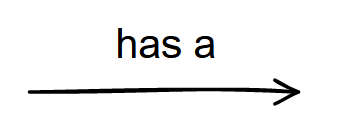

# Code using strategy design pattern

Lets recap the strategy design pattern official definition of the **Head First Design Patterns** book:

> The strategy design pattern defines a family of algorithms, encapsulates each one and makes them interchangeable. Strategy lets the algorithm very independently from clients that use it.

This is exactly what we got here. We got the quack algorithm and we got the fly algorithm and because we already saw that we cannot inherit this algorithm vertically, we need to extract them from the superclass.


From the definition, the city duck is a client and the wild duck is another client (and based on the UML diagram that we used in the documentation before, the mountain duck is another client, the rubber duck another and so on).

So, we will create strategies for quacking and strategies for flying:


Now we just need to do the same to fly:


Pay attention to the arrows:

> **Inheritance**
> 
> 
> 
> **Composition**
> 
> 

This means that every `Duck` must have a quack strategy and every `Duck` must have a fly strategy!

**Now we are using composition!**

With this, something needs to implement a quack behavior and something needs to implement the fly behavior too.

To do this, lets assume that the requirement defines that a city duck has a quiet quack and the wild duck has a loud quack:


Now, the `Duck` class, previously, had an implementation for the quack method but now, suing composition, the implementation is no longer in the `Duck` class but in the classes that implement that Strategy, the quack strategy. As we can see in the diagram, we have two classes who implement that interface and now, we can use whichever we want/need.

**How can we do that?**

We can do that using dependency injection. We just need to receive a `IQuackStrategy` in the constructor of the `Duck` class and, the clients, just need to pass the strategy that fits the best their needs, in other words, the requirements.

This way, the implementation is no longer attached to a superclass but instead is attached to an implementation, the superclass just delegates to the implementation.

Example of code using dependency injection:

```csharp
public abstract class Duck : IQuackStrategy, IFlyStrategy
{
    private readonly IQuackStrategy _quackStrategy;
    private readonly IFlyStrategy _flyStrategy;

    protected Duck(IQuackStrategy quackStrategy, IFlyStrategy flyStrategy)
    {
        _quackStrategy = quackStrategy;
        _flyStrategy = flyStrategy;
    }
}
```

> 📝 **NOTE**
> 
> Just to be clear, we could of course discard the `IQuackStrategy` interface and just call the `QuietQuackStrategy` or another name that we want but then we will lose all the dependency inversion and flexibility

We now can, without almost any additional effort, add more types of ducks and another methods:


This is an example of the usage of the strategy pattern!

Now, the rubber duck, for example, no longer need to override the fly and quack methods because the client just need to inject the `NoFlyStrategy` and the `NoQuackStrategy` in order to create a rubber duck.

If we want, we can even go further and abstract the `Display` method 👇


With this, we completed the example use case using the strategy pattern in our code.

Check the code and run it to see in action. To do that, you can use your IDE buttons/options or via terminal, executing the following command:

> before executing the command, `cd` to this repository root directory

```bash
dotnet run --project ./StrategyPattern/StrategyPattern.WithPattern/StrategyPattern.WithPattern.csproj
```